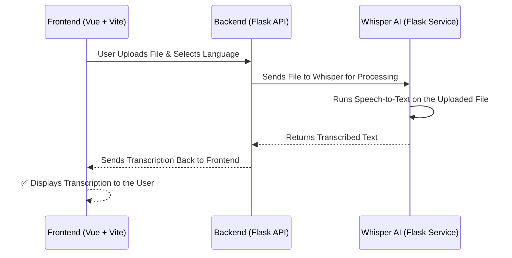

Welcome to this step-by-step tutorial on building an **AI-powered transcription app**. We’ll use **OpenAI’s Whisper**, **Flask**, and **Vue.js** to create a scalable app that converts speech to text.

By the end of this guide, you'll have:

✅ A **Whisper-powered transcription API**

✅ A **Flask backend** to handle requests

✅ A **Vue frontend** for user interaction

---

## **📌 Part 1: Understanding the Project Structure**

Before diving into coding, let’s define the **project architecture** and **why we chose these technologies**.

### **🎯 What Are We Building?**
- Users upload an **audio file (`.wav`)**.
- The backend sends it to **OpenAI’s Whisper model**.
- The transcribed text is returned and **displayed in the frontend**.

### **🛠️ Why These Technologies?**

| Technology   | Why We Chose It |
|-------------|----------------|
| **Whisper AI**  | OpenAI’s best **speech-to-text** model. |
| **Flask**       | A lightweight **Python backend**. |
| **Vue + Vite**  | Fast, reactive UI for a great experience. |
| **Docker**      | Ensures everything runs **consistently**. |

### **🔗 High-Level Architecture**



---

## **📌 Part 2: Setting Up the Project**

The project follows a modular structure, with separate folders for each component. It's somehow following a **microservice approach**, where **Whisper AI runs as a separate service** instead of being embedded inside the backend.
I believe this improves **scalability, flexibility, and performance**.

### **🗂️ Folder Structure**
```bash
whisperwave/
├── backend/             # Flask API (handles file upload & sends request to Whisper)
│   ├── app.py           # Main Flask application
│   ├── requirements.txt # Backend dependencies
│   ├── Dockerfile       # Docker setup for backend
│   └── uploads/         # Shared folder for uploaded files
│
├── frontend/            # Vue.js (Vite) frontend
│   ├── src/             # Vue components
│   ├── public/          # Static assets
│   ├── package.json     # Frontend dependencies
│   ├── Dockerfile       # Docker setup for frontend
│   └── vite.config.js   # Vite configuration
│
├── whisper_service/     # Whisper AI Service (Flask + Whisper)
│   ├── app.py           # Main Whisper transcription API
│   ├── Dockerfile       # Docker setup for Whisper
│   ├── requirements.txt # Dependencies for Whisper
│
├── docker-compose.yml   # Defines & runs all services
├── README.md            # Documentation
```

### **💭 Understanding Each Component**
#### **1️⃣ Backend (Flask)**
- **Handles file uploads**.
- **Calls the Whisper API** for transcription.
- **Returns transcribed text to the frontend**.

#### **2️⃣ Frontend (Vue + Vite)**
- **Lets users upload `.wav` files**.
- **Allows language selection**.
- **Displays transcribed text**.

#### **3️⃣ Whisper Service**
- **Loads the OpenAI Whisper model**.
- **Processes audio files**.
- **Returns transcribed text to the backend**.

#### **4️⃣ Docker Compose**
- **Orchestrates all services** (backend, frontend, and Whisper AI).
- **Ensures they can communicate seamlessly**.

### **🛠️ Why Keep Whisper as a Separate Service?**

✅ **Scalability** → The backend remains lightweight and doesn’t slow down when multiple users upload files.

✅ **Performance Optimization** → Whisper is a **heavy ML model**, so keeping it separate helps with resource management.

✅ **Supports Multiple Models** → We can run **different Whisper models** (`base`, `large`, multilingual, etc.).

✅ **Other Apps Can Use It** → Any external app can **call the Whisper API** without needing to integrate Flask.

---

## **📌 Part 3: Implementing the Whisper Service (Speech-to-Text API)**

Before building the backend and frontend, we’ll first **set up the Whisper service**.
By implementing this first, we will have a **standalone API** that anyone can test using **Postman, cURL, or other tools**.

### **1️⃣ Installing Dependencies**

Since **Whisper is a machine-learning model**, it requires **Python, PyTorch, and FFmpeg** to function. If you want to test **outside Docker**, install dependencies manually:

```bash
pip install --upgrade openai-whisper torch flask flask-cors werkzeug
sudo apt-get install -y ffmpeg  # Linux/Mac (Windows users need ffmpeg.exe)
```

### **2️⃣ Creating the Whisper API**

Now, let’s create the **Flask API** that will:
- **Load the Whisper model.**
- **Accept a POST request with a file path & language.**
- **Return the transcribed text.**

Create `whisper_service/app.py`:
```python
import whisper
import os
from flask import Flask, request, jsonify
from flask_cors import CORS

app = Flask(__name__)
CORS(app)

model = whisper.load_model("base")

@app.route("/transcribe", methods=["POST"])
def transcribe():
    data = request.get_json()
    file_path = data.get("file_path")
    language = data.get("language", "en")

    if not os.path.exists(file_path):
        return jsonify({"error": "File not found"}), 400

    result = model.transcribe(file_path, fp16=False, language=language)
    return jsonify({"transcription": result["text"]})

if __name__ == "__main__":
    app.run(host="0.0.0.0", port=6000)
```

### **3️⃣ Understanding the Code (Line-by-Line)**
#### **1️⃣ Importing Required Libraries**
```python
import whisper
import os
from flask import Flask, request, jsonify
from flask_cors import CORS
```
- `import whisper` → Loads the **OpenAI Whisper model** for speech-to-text.
- `import os` → Used to **check if the file exists** before processing.
- `from flask import Flask, request, jsonify` → Creates a **Flask web server** that listens for API requests.
- `from flask_cors import CORS` → Allows **Cross-Origin Resource Sharing (CORS)**, enabling other applications (like a frontend) to call this API.


#### **2️⃣ Initializing Flask and Enabling CORS**
```python
app = Flask(__name__)
CORS(app)
```
- `app = Flask(__name__)` → Creates a **Flask web application** to handle API requests.
- `CORS(app)` → Enables **Cross-Origin Resource Sharing**, which allows requests from the frontend or Postman.

#### **3️⃣ Loading the Whisper AI Model**
```python
model = whisper.load_model("base")
```
- **Loads the Whisper model** into memory.
- The `"base"` model is used by default, but you can change it to `"small"`, `"medium"`, `"large"`, or `"large-v2"`.
- **Larger models** have **better accuracy** but require **more processing power**.

🔹 **To use a larger model, modify this line**:
```python
model = whisper.load_model("large")
```
- If running on **GPU**, ensure PyTorch has CUDA enabled:
  ```python
  import torch
  print(torch.cuda.is_available())  # Should return True if GPU is available
  ```

#### **4️⃣ Creating the Transcription API Endpoint**
```python
@app.route("/transcribe", methods=["POST"])
def transcribe():
```
- **Defines a POST API endpoint**: `http://localhost:6000/transcribe`.
- **Clients send requests** containing a **file path & language selection**.

#### **5️⃣ Extracting Request Data**
```python
data = request.get_json()
file_path = data.get("file_path")
language = data.get("language", "en")
```
- `request.get_json()` → Extracts **JSON data** from the POST request.
- `file_path = data.get("file_path")` → Retrieves the **file path** (required).
- `language = data.get("language", "en")` → Retrieves the **language** (default is `"en"` for English).

#### **6️⃣ Debug Logging (For Testing)**
```python
print(f"📥 Received request: file_path={file_path}, language={language}", flush=True)
```
- Prints **received request data** to the logs.
- `flush=True` ensures logs **appear immediately** in Docker.


#### **7️⃣ Handling Missing or Invalid Files**
```python
if not file_path:
    return jsonify({"error": "Missing `file_path` in request"}), 400
```
- If no file path is provided, **return an HTTP 400 (Bad Request) error**.

```python
if not os.path.exists(file_path):
    print(f"❌ Error: File does not exist at {file_path}", flush=True)
    return jsonify({"error": f"File not found: {file_path}"}), 400
```
- **Checks if the file actually exists** before sending it to Whisper.
- If the file **does not exist**, **returns a 400 error** with a message.


#### **8️⃣ Transcribing Audio Using Whisper**
```python
result = model.transcribe(file_path, fp16=False, language=language)
```
- `model.transcribe(file_path, fp16=False, language=language)` runs **speech-to-text processing**.
- `fp16=False` ensures **full-precision processing** (FP16 is not supported on CPUs).
- **Returns a dictionary** containing the transcription.


#### **9️⃣ Returning the Transcription**
```python
return jsonify({"transcription": result["text"]})
```
- Extracts the **transcribed text** from the Whisper result.
- Returns a **JSON response** with the text.

**Example Response:**
```json
{
  "transcription": "Hello, this is a test."
}
```


#### **🔟 Handling Errors Gracefully**
```python
except Exception as e:
    print(f"❌ Whisper Error: {e}", flush=True)
    return jsonify({"error": "Failed to transcribe audio"}), 500
```
- Catches **any unexpected errors**.
- Logs the error and returns a **500 (Internal Server Error)**.


#### **1️⃣1️⃣ Running the Flask App**
```python
if __name__ == "__main__":
    app.run(host="0.0.0.0", port=6000)
```
- Starts the **Flask web server** on **port 6000**.
- `host="0.0.0.0"` makes it accessible inside **Docker**.


### **4️⃣ Running the Whisper Service Locally**
```bash
python whisper_service/app.py
```

Test with:
```bash
curl -X POST http://localhost:6000/transcribe \
     -H "Content-Type: application/json" \
     -d '{"file_path": "test.wav", "language": "en"}'
```

Expected Response:
```json
{
  "transcription": "This is a test transcription."
}
```


### **5️⃣ Dockerizing the Whisper Service**
To make this **portable and easy to deploy**, we will **Dockerize it**.

#### **📄 Create `whisper_service/Dockerfile`**
```dockerfile
# Use Python base image
FROM python:3.9

# Set working directory
WORKDIR /app

# Install system dependencies (FFmpeg required for Whisper)
RUN apt-get update && apt-get install -y ffmpeg

# Install Python dependencies
RUN pip install --no-cache-dir openai-whisper flask flask-cors werkzeug torch torchaudio

# Copy the app files
COPY . .

# Expose the API port
EXPOSE 6000

# Start the service
CMD ["python", "app.py"]
```

---

### **6️⃣ Running the Whisper Service in Docker**
#### **🔹 1. Build the Docker Image**
```bash
docker build -t whisper-service ./whisper_service
```

#### **🔹 2. Run the Whisper Container**
```bash
docker run -p 6000:6000 whisper-service
```

Now the Whisper API should be accessible at **`http://localhost:6000/transcribe`**.

---

### **7️⃣ Testing Whisper API in Docker**
Once the container is running, test it using `curl`:

```bash
curl -X POST http://localhost:6000/transcribe \
     -H "Content-Type: application/json" \
     -d '{"file_path": "test.wav", "language": "en"}'
```

If everything works, **Whisper should return the transcribed text**.


## **📌 Part 4: Implementing the Flask Backend**
### **1️⃣ Installing Dependencies**
```bash
pip install flask flask-cors requests werkzeug
```

### **2️⃣ Writing the Flask API**
Create `backend/app.py`:
```python
import os
import requests
from flask import Flask, request, jsonify
from werkzeug.utils import secure_filename
from flask_cors import CORS

app = Flask(__name__)
CORS(app)

UPLOAD_FOLDER = "/uploads"
WHISPER_URL = "http://whisper:6000/transcribe"
os.makedirs(UPLOAD_FOLDER, exist_ok=True)

@app.route("/transcribe", methods=["POST"])
def transcribe_audio():
    if "file" not in request.files:
        return jsonify({"error": "No file uploaded"}), 400

    file = request.files["file"]
    filename = secure_filename(file.filename)
    file_path = os.path.join(UPLOAD_FOLDER, filename)
    file.save(file_path)

    response = requests.post(WHISPER_URL, json={"file_path": file_path, "language": "en"})

    return response.json() if response.status_code == 200 else jsonify({"error": "Failed to transcribe"}), 500

if __name__ == "__main__":
    app.run(host="0.0.0.0", port=5000)
```

### **3️⃣ Running the Flask Backend**
```bash
python backend/app.py
```

Test with:
```bash
curl -X POST http://localhost:5000/transcribe \
     -F "file=@test.wav" \
     -F "language=en"
```
